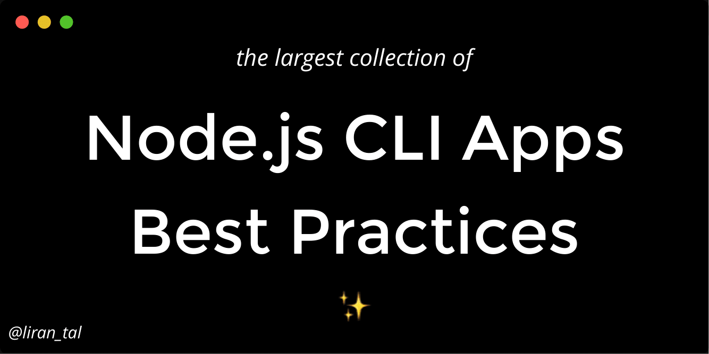

<p align="center">
  
</p>

<p align="center">
  <h1 align="center">Node.js CLI Apps Best Practices</h1>
A collection of curated best practices on how to build successful, empathic and user-friendly Node.js Command Line Interface (CLI) applications.
</p>

### Why this guide?

A bad CLI can easily discourage users from interacting with it. Building successful CLIs requires attention to detail and empathy for the user in order to create a good user experience. It is very easy to get wrong.

In this guide I have compiled a list of best practices across areas of focus which aim to optimize for an ideal user experience when interacting with a CLI application.

### Features:

- ✅ 28 best practices for building successful Node.js CLI applications
- ✅ Read in a different language: [🇨🇳](./README_zh-CN.md), [🇪🇸](./README_es.md), or help translate to other languages: [ [🇩🇪](./README-de.md) , ... ]
- 🙏 Contributions are welcome

<!-- Shields -->
<p align="center">
<a rel="license" href="http://creativecommons.org/licenses/by-sa/4.0/"></a>

<a href="https://www.github.com/lirantal/nodejs-cli-apps-best-practices" target="_blank">
  
</a>
</p>

### Why me?

Hi there, I'm [Liran Tal](https://twitter.com/liran_tal) and I'm addicted to building command line applications.

Some of my recent work, building Node.js CLIs, includes the following Open Source projects:

<!-- prettier-ignore-start -->
<!-- markdownlint-disable -->
<table>
  <tr>
     <td align="center">
      <a href="https://github.com/lirantal/dockly"><br /><sub><b>Dockly</b></sub></a><br/>Immersive terminal interface for managing docker containers and services
     </td>
     <td align="center">
      <a href="https://github.com/lirantal/npq"><br /><sub><b>npq</b></sub></a><br/>safely install packages with npm/yarn by auditing them as part of your install process
     </td>
     <td align="center">
      <a href="https://github.com/lirantal/lockfile-lint"><br /><sub><b>lockfile-lint</b></sub></a><br/>Lint an npm or yarn lockfile to analyze and detect security issues
     </td>
     <td align="center">
      <a href="https://github.com/lirantal/is-website-vulnerable"><br /><sub><b>is-website-vulnerable</b></sub></a><br/>finds publicly known security vulnerabilities in a website's frontend JavaScript libraries
     </td>
  </tr>
</table>
<!-- markdownlint-enable -->
<!-- prettier-ignore-end -->

### The Team ✨

Thanks goes to these wonderful people ([emoji key](https://allcontributors.org/docs/en/emoji-key)):

<!-- ALL-CONTRIBUTORS-LIST:START - Do not remove or modify this section -->
<!-- prettier-ignore-start -->
<!-- markdownlint-disable -->
<table>
  <tr>
    <td align="center"><a href="https://blog.vvni.top/"><br /><sub><b>Vanilla</b></sub></a><br /><a href="#translation-vvni" title="Translation">🌍</a></td>
    <td align="center"><a href="https://terkel.com"><br /><sub><b>Terkel</b></sub></a><br /><a href="#content-terkelg" title="Content">🖋</a></td>
    <td align="center"><a href="http://jasonkarns.com"><br /><sub><b>Jason Karns</b></sub></a><br /><a href="#content-jasonkarns" title="Content">🖋</a></td>
    <td align="center"><a href="https://about.me/davesag"><br /><sub><b>Dave Sag</b></sub></a><br /><a href="#maintenance-davesag" title="Maintenance">🚧</a></td>
    <td align="center"><a href="https://josejpr.com"><br /><sub><b>José J. Pérez Rivas</b></sub></a><br /><a href="#translation-JoseJPR" title="Translation">🌍</a></td>
    <td align="center"><a href="https://twitter.com/MSuresh100"><br /><sub><b>Sureshraj</b></sub></a><br /><a href="#content-m-sureshraj" title="Content">🖋</a></td>
  </tr>
</table>

<!-- markdownlint-enable -->
<!-- prettier-ignore-end -->
<!-- ALL-CONTRIBUTORS-LIST:END -->

---

<h3>Table of Contents</h3>

- 1 Command Line Experience
  - 1.1 [Respect POSIX args](#11-respect-posix-args)
  - 1.2 [Build empathic CLIs](#12-build-empathic-clis)
  - 1.3 [Stateful data](#13-stateful-data)
  - 1.4 [Provide a colorful experience](#14-provide-a-colorful-experience)
  - 1.5 [Rich interactions](#15-rich-interactions)
  - 1.6 [Hyperlinks everywhere](#16-hyperlinks-everywhere)
  - 1.7 [Zero configuration](#17-zero-configuration)
  - 1.8 [Respect POSIX signals](#18-respect-posix-signals)
- 2 Distribution
  - 2.1 [Prefer a small dependency footprint](#21-prefer-a-small-dependency-footprint)
  - 2.2 [Use the shrinkwrap, Luke](#22-use-the-shrinkwrap-luke)
  - 2.3 [Cleanup configuration files](#23-cleanup-configuration-files)
- 3 Interoperability
  - 3.1 [Accept input as STDIN](#31-accept-input-as-stdin)
  - 3.2 [Enable structured output](#32-enable-structured-output)
  - 3.3 [Cross-platform etiquette](#33-cross-platform-etiquette)
  - 3.4 [Support configuration precedence](#34-support-configuration-precedence)
- 4 Accessibility
  - 4.1 [Containerize the CLI](#41-containerize-the-cli)
  - 4.2 [Graceful degradation](#42-graceful-degradation)
  - 4.3 [Node.js versions compatibility](#43-nodejs-versions-compatibility)
  - 4.4 [Shebang autodetect the Node.js runtime](#44-shebang-autodetect-the-nodejs-runtime)
- 5 Testing
  - 5.1 [Put no trust in locales](#51-put-no-trust-in-locales)
- 6 Errors
  - 6.1 [Trackable errors](#61-trackable-errors)
  - 6.2 [Actionable errors](#62-actionable-errors)
  - 6.3 [Provide debug mode](#63-provide-debug-mode)
  - 6.4 [Proper use of exit codes](#64-proper-use-of-exit-codes)
  - 6.5 [Effortless bug reports](#65-effortless-bug-reports)
- 7 Development
  - 7.1 [Use a bin object](#71-use-a-bin-object)
  - 7.2 [Use relative paths](#72-use-relative-paths)
  - 7.3 [Use the files field](#73-use-the-files-field)

---

# 1 Command Line Experience

This section deals with best practices concerned with creating beautiful and high-value user experience Node.js command line applications.

In this section:

- 1.1 [Respect POSIX args](#11-respect-posix-args)
- 1.2 [Build empathic CLIs](#12-build-empathic-clis)
- 1.3 [Stateful data](#13-stateful-data)
- 1.4 [Provide a colorful experience](#14-provide-a-colorful-experience)
- 1.5 [Rich interactions](#15-rich-interactions)
- 1.6 [Hyperlinks everywhere](#16-hyperlinks-everywhere)
- 1.7 [Zero configuration](#17-zero-configuration)
- 1.8 [Respect POSIX signals](#18-respect-posix-signals)

<br/>

### 1.1 Respect POSIX args

✅ **Do:**
Use [POSIX-compliant](https://pubs.opengroup.org/onlinepubs/9699919799/basedefs/V1_chap12.html) command line argument syntax, which is widely accepted as a standard for command line tools.

❌ **Otherwise:**
Users may get frustrated when a CLI's syntax for arguments, options, or command parameters deviate from the de facto Unix standards they are used to.

ℹ️ **Details**

Unix-like operating systems popularized the use of the command line and tools such as `awk`, `sed`. Such tools have effectively standardized the behavior of command line options (aka flags), options-arguments, and other operands.

Some examples of expected behavior:

- option-arguments or options can be notated in help or examples as square brackets (`[]`) to indicate they are optional, or with angle brackets (`<>`) to indicate they are required.
- allow short-form single letter arguments as aliases for long-form arguments (see reference from the [GNU Coding Standards](https://www.gnu.org/prep/standards/html_node/Command_002dLine-Interfaces.html)).
- options specified using the short form singular `-` may container one alphanumeric character.
- specifying multiple options with no values may be grouped, such as `myCli -abc` being equivalent to `myCli -a -b -c`.

Command line power-users will expect your command line application to have similar conventions as other Unix apps.

📦 **Recommended packages**

Reference to Open Source Node.js packages:

- [commander](https://github.com/tj/commander.js#readme)
- [yargs](https://github.com/yargs/yargs)

### 1.2 Build empathic CLIs

✅ **Do:**
Put workflows in place that assist the user to interact with the CLI successfully, when otherwise such interactions would result in errors and frustration.

❌ **Otherwise:**
Failing to provide actionable assistance in supporting the user will result in frustration due to the lack of capability to operate the CLI.

ℹ️ **Details**

A command line interface for your program is no different than a web user interface in the sense of doing as much as you can as the program author to ensure that it is being used successfully.

Optimize for successful interactions by building empathic CLIs that support the user. As an example, let's explore the case of the `curl` program that expects a URL as its primary data input, and the user failing to provide it. Such failure will lead to reading through a (hopefully) descriptive error messages or reviewing a `curl --help` output. However, an empathic CLI would have presented an interactive prompt to capture input from the user, resulting in a successful interaction.

### 1.3 Stateful data

✅ **Do:**
Provide a stateful experience between multiple invocations of your CLI app, and remember values and data in order to provide seamless interaction.

❌ **Otherwise:**
Requiring your user to repeatedly provide the same information with multiple invocations of the CLI will annoy your user.

ℹ️ **Details**

It may happen that you find yourself needing to provide storage persistence for your CLI application, such as remembering a username, email, API token, or other preferences between multiple invocations of the CLI. Use a configuration helper that allows the app to persist such user settings. Be sure to follow the [XDG Base Directory Specification](https://specifications.freedesktop.org/basedir-spec/basedir-spec-latest.html) when reading/writing files (or choose a configuration helper that respects the spec). These keeps the user in control of where files are written and managed.

Reference projects:

- [configstore](https://www.npmjs.com/package/configstore)
- [conf](https://www.npmjs.com/package/conf)

### 1.4 Provide a colorful experience

✅ **Do:**
Make use of colors in your CLI application to highlight parts of your app's output, and provide a graceful degradation, or color detection, to allow automatic opt-out so that output isn't garbled. Ensure manual opt-in and opt-out is possible via CLI option, environment variable, and/or config file.

❌ **Otherwise:**
Information may easily get lost in pale program output, especially when the output is text-heavy.

ℹ️ **Details**

Most terminals used today to interact with command line applications support colored text such as these enabled by specially crafted ANSI encoded characters.

A colorful display in your command line application output may further contribute to a richer experience and increased interaction. That said, unsupported terminals may experience a degraded output in the form of garbled information on the screen. Furthermore, a CLI may be used in a continuous integration build job which may not support colored output. Even outside of build servers, a CLI may be used through an IDE's console that may not handle certain characters. Manual opt-out must be available.

Reference projects:

- [chalk](https://www.npmjs.com/package/chalk)
- [colors](https://www.npmjs.com/package/colors)
- [kleur](https://www.npmjs.com/package/kleur)

📦 **Recommended packages**

Reference to Open Source Node.js packages:

- [chalk](https://www.npmjs.com/package/chalk)
- [colors](https://www.npmjs.com/package/colors)
- [kleur](https://www.npmjs.com/package/kleur)

### 1.5 Rich interactions

✅ **Do:**
Leverage the use of rich command line interactions beyond the basics of text input prompt to provide a smoother experience for CLI users.

❌ **Otherwise:**
A text prompt as input may prove cumbersome for users when data to reason about is in the form of closed options (i.e: dropdowns).

ℹ️ **Details**

Rich interactivity can be introduced in the form of prompt inputs, which are more sophisticated than free text, such as dropdown select lists, radio button toggles, rating, auto-complete, or hidden password inputs.

Another type of rich interactivity is in the form of animated loaders and progress-bars which provide a better experience for users when asynchronous work is being performed.

Many CLIs provide default command line arguments without requiring any further interactive experience. Don't force your users to provide parameters that the app can work out for itself.

📦 **Recommended packages**

Reference to Open Source Node.js packages:

- [enquirer](https://www.npmjs.com/package/enquirer)
- [ora](https://www.npmjs.com/package/ora)
- [ink](https://www.npmjs.com/package/ink)
- [prompts](https://www.npmjs.com/package/prompts)

### 1.6 Hyperlinks everywhere

✅ **Do:**
Use properly formatted hyperlinks in text output for both URLs (e.g: `https://www.github.com`), as well as source code (e.g: `src/Util.js:2:75`) - both of which a modern terminal is able to transform into a clickable link.

❌ **Otherwise:**
Avoid broken and non-interactive links like `git.io/abc` which requires your user to copy and paste manually.

ℹ️ **Details**

If you are sharing links to URLs, or pointing to a file and a specific line number and column in the file, you can provide properly formatted links to both of these examples that, once clicked, will open up the browser, or an IDE at the defined location.

Reference projects:

- [open](https://github.com/sindresorhus/open)

### 1.7 Zero configuration

✅ **Do:**
Optimize a plug-and-play experience by auto-detecting required configuration and command line arguments values.

❌ **Otherwise:**
Don't force user interactivity if a command-line argument can be auto-detected in a reliable way, and the action invoked doesn't explicitly require user interaction (such as confirming a deletion).

ℹ️ **Details**

Aim to provide a "works out of the box" experience when running the CLI application.
For example, [POSIX defines a standard for environment variable configuration](https://pubs.opengroup.org/onlinepubs/009695399/basedefs/xbd_chap08.html) used for different purposes, such as: `TMPDIR`, `NO_COLOR`, `DEBUG`, `HTTP_PROXY` and others. Detect these automatically and prompt for confirmation when necessary.

Reference projects which are built around Zero configuration:

- The [Jest JavaScript Testing Framework](https://jestjs.io)
- [Parcel](https://parceljs.org), a web application bundler

### 1.8 Respect POSIX signals

✅ **Do:**
Ensure your program respects [POSIX signals](http://man7.org/linux/man-pages/man7/signal.7.html) to allow it proper interaction with users or other programs.

❌ **Otherwise:**
Your program will not play well with other programs and introduce unexpected behavior.

ℹ️ **Details**

Especially for CLI applications, it is common to interact with user input and improperly managing keyboard events
may result in your app failing to respond to SIGINT interrupts, commonly used by users when they hit the `CTRL+C` keys.

The problem of not respecting process signals worsens when the program is being orchestrated by non-human interaction. For example, a CLI that runs in a docker container but will not respond to software interrupt signals sent to it.

# 2 Distribution

This section deals with best practices concerned with distributing and packaging a Node.js command line application in an optimal matter for consumers.

In this section:

- 2.1 [Prefer a small dependency footprint](#21-prefer-a-small-dependency-footprint)
- 2.2 [Use the shrinkwrap, Luke](#22-use-the-shrinkwrap-luke)
- 2.3 [Cleanup configuration files](#23-cleanup-configuration-files)

### 2.1 Prefer a small dependency footprint

✅ **Do:**
Minimize your use of production dependencies, use alternative dependencies which are smaller, and vet your dependencies' footprints as well for transitive dependencies to ensure a small bundle of the Node.js CLI. Balance this by being careful to not over-optimize use of dependencies by reinventing the wheel.

❌ **Otherwise:**
The size and use of dependencies in the application will impact the install time of your Node.js CLI, potentially providing a poor user experience.

ℹ️ **Details**

A fast `npm install` for Node.js CLIs invoked with `npx` will provide a better user experience. This is made possible when the overall dependency, and transitive dependency, footprint is kept to a reasonable size.

A one-off global `npm` installation of a slow-to-install `npm` package will offer a one-off poor experience, but the use of `npx` by users to invoke executable packages will make the degraded performance, due to `npx` always fetching and installing packages from the registry, more significant and obvious.

Reference projects:

- [Bundlephobia](https://bundlephobia.com/) is a tool to help you find the cost of a npm package.

### 2.2 Use the shrinkwrap, Luke

✅ **Do:**
Use npm's `npm-shrinkwrap.json` as a lockfile to ensure that pinned-down dependency versions (direct and transitive) propagate to your end users when they install your npm package.

❌ **Otherwise:**
Not fixing the versions of your app's dependencies will mean that the package manager (e.g. `npm`) will resolve them during installation, and transitive dependencies installed via version ranges may introduce breaking changes that you can't control, that may result in your Node.js CLI application failing to build or run.

ℹ️ **Details**

Use the ~~force~~ shrinkwrap, Luke!

Typically, an npm package only defines its direct dependencies, and their version range, when being installed, and the npm package manager will resolve all the transitive dependencies' versions upon installation. Over time, the resolved versions of dependencies will vary, as new direct, and transitive dependencies will release new versions.

Even though [Semantic Versioning](https://semver.org/) is broadly accepted among maintainers, npm is [known to introduce many dependencies](https://snyk.io/blog/how-much-do-we-really-know-about-how-packages-behave-on-the-npm-registry/) for an average package being installed, which adds to the risk of a package introducing changes that may break your application.

The flip side of using `npm-shrinkwrap.json` is the security implications you are forcing upon your consumers. The dependencies being installed are pinned to specific versions, so even if newer versions of these dependencies are released, they won't be installed. This moves the responsibility to you, the maintainer, to stay up-to-date with any security fixes in your dependencies, and release your CLI application regularly with security updates. Consider using [Snyk Dependency Upgrade](https://snyk.io/) to automatically fix security issues across your dependency tree. _Full disclosure: I am a developer advocate at Snyk._

> 👍 Tip
>
> Use `npm shrinkwrap` command to generate the shrinkwrap lockfile, which is of the same
> format as that of a `package-lock.json` file.

References:

- [Do you really know how a lockfile works for yarn and npm packages?](https://snyk.io/blog/making-sense-of-package-lock-files-in-the-npm-ecosystem/)
- [Yarn docs: Should lockfiles be committed to the repository?](https://next.yarnpkg.com/advanced/qa#should-lockfiles-be-committed-to-the-repository)

### 2.3 Cleanup configuration files

✅ **Do:**
Cleanup configuration files when the CLI application gets uninstalled. Optionally, CLI applications can prompt your users to keep the configuration files to skip the re-initialising phase on the next installation for a better user experience.

❌ **Otherwise:**
The user's file system may contain residue in the form of orphaned configuration files, and identifiable data which the CLI tool introduced when installed.

ℹ️ **Details**

As mentioned in the [stateful data section](#13-stateful-data), if your CLI application uses persistent storage, such as to save configuration files, then the CLI application should also be responsible for removing its configuration files when it gets uninstalled.

You can use NPMs `pre` or `post` uninstall [script](https://docs.npmjs.com/misc/scripts) for this purpose. You can find a working example in this [repository](https://github.com/m-sureshraj/jenni/blob/master/src/scripts/pre-uninstall.js).

# 3 Interoperability

This section deals with best practices concerned with making your Node.js CLI seamlessly integrate with other command line tools, and following conventions that are natural for CLIs to operate in.

This section answers questions such as:

- _Can I export the output of this CLI for easy parsing?_
- _Can I pipe the output of this CLI to the input of another command line tool?_
- _Can I pipe the result of another tool to this CLI?_

In this section:

- 3.1 [Accept input as STDIN](#31-accept-input-as-stdin)
- 3.2 [Enable structured output](#32-enable-structured-output)
- 3.3 [Cross-platform etiquette](#33-cross-platform-etiquette)
- 3.4 [Support configuration precedence](#34-support-configuration-precedence)

### 3.1 Accept input as STDIN

✅ **Do:**
For command line applications that are expected to work with data, make it easy for a user to pipe the data to standard input (STDIN).

❌ **Otherwise:**
Other command line applications will not be able to provide their result, directly as input for your CLI, which prevents common UNIX one-liners such as:

```sh
$ curl -s "https://api.example.com/data.json" | your_node_cli
```

ℹ️ **Details**

If the command line application works with data, such as performing some kind of task on a JSON file that is usually specified with `--file <file.json>` command line argument.

An example that is based on the official [Node.js API docs for the for readline module](https://nodejs.org/api/readline.html)  of how taking input from a command pipe is as follows:

```js
const readline = require("readline");

const rl = readline.createInterface({
  input: process.stdin,
  output: process.stdout
});

rl.question("What do you think of Node.js? ", answer => {
  // TODO: Log the answer in a database
  console.log(`Thank you for your valuable feedback: ${answer}`);

  rl.close();
});
```

Then pipe the input to the above Node.js application:

```sh
echo "Node.js is amazing" | node cli.js
```

### 3.2 Enable structured output

✅ **Do:**
Enable a flag to allow structured output of the app's result, if such result is available, to enable parsing and easy manipulation of the data.

❌ **Otherwise:**
Users of the CLI may need to apply complicated regex parsing and matching techniques to extract the output data provided by your CLI.

ℹ️ **Details**

It is often useful for users of a command line application to parse the data and perform other tasks with it, such as using it to feed web dashboards, or email notifications.

Being able to easily extract the data of interest from a command line output provides a friendlier experience to users of your CLI.

### 3.3 Cross-platform etiquette

✅ **Do:**
If a CLI is expected to function across platforms, proper attention must be given to semantics of command shells, and components such as file systems, along with developers leveraging relevant programming constructs.

❌ **Otherwise:**
The CLI will break on other operating systems due to factors such as incorrect path separator characters, even though there are no functional differences in the code.

ℹ️ **Details**

Even though, from a program's perspective, the functionality isn't being stripped down and _should_ execute well in different operating systems, some missed nuances may render the program inoperable. Let's explore several cases where cross-platform ethics must be honored.

#### Wrongly spawning a command

You might need to spawn a process that runs a Node.js program. For example, you have the following script:

`program.js`

```js
#!/usr/bin/env node

// the rest of your app code
```

This works:

```
const cliExecPath = 'program.js'
const process = childProcess.spawn(cliExecPath, [])
```

This is better:

```
const cliExecPath = 'program.js'
const process = childProcess.spawn('node', [cliExecPath])
```

Why is it better? The `program.js` source code begins with the Unix-like [Shebang](<https://en.wikipedia.org/wiki/Shebang_(Unix)>) notation, however Windows doesn't know how to interpret this due to the fact that Shebang isn't a cross-platform standard.

This is also true for `package.json` scripts. Consider the following bad practice
of defining an npm run script:

```
"scripts": {
  "postinstall": "myInstall.js"
}
```

This is due to the fact that the Shebang in `myInstalls.js` will not help Windows
understand how to run this with the `node` interpreter.

Instead, follow the best practice of:

```
"scripts": {
  "postinstall": "node myInstall.js"
}
```

#### Shell interpreters vary

Not all characters are treated the same across different shell interpreters.

For example, the Windows command prompt doesn't treat a single quote the same as a double quote,
as would be expected on a bash shell, and so it doesn't recognize that the whole string inside
a single quote belongs to the same string group, which will lead to errors.

This will fail in a Windows Node.js environment that uses the Windows command prompt:

package.json

```
"scripts": {
  "format": "prettier-standard '**/*.js'",
  ...
}
```

To fix this so that this `npm run` script will indeed be cross-platform between Windows, macOS and Linux:

package.json

```
"scripts": {
  "format": "prettier-standard \"**/*.js\"",
  ...
}
```

In this example we had to use double quotes and escape them with the JSON notation.

#### Avoid concatenating paths

Paths are constructed differently across different platforms. When they are built
manually by concatenating strings they are bound not to be interoperable between
different platforms.

Let's consider the following bad practice example:

```js
const myPath = `${__dirname}/../bin/myBin.js`;
```

It assumes that forward slash is the path separator where on Windows, for example,
a backslash is used.

Instead of manually building filesystem paths, defer to Node.js's own `path`
module to do this:

```js
const myPath = path.join(__dirname, "..", "bin", "myBin.js");
```

#### Avoid chaining commands with semicolons

Linux shells are known to support a semicolon (`;`) to chain commands to run
sequentially, such as: `cd /tmp; ls`. However, doing the same on Windows will fail.

Avoid doing the following:

```js
const process = childProcess.exec(`${cliExecPath}; ${cliExecPath2}`);
```

Instead, use the double ampersand or double pipe notations:

```js
const process = childProcess.exec(`${cliExecPath} || ${cliExecPath2}`);
```

### 3.4 Support configuration precedence

✅ **Do:**
Allow configuration to be obtained from multiple sources, by order of precedence. Command line arguments take highest priority, followed by shell variables, and then different levels of configuration.

❌ **Otherwise:**
Users face frustration when customizing their experience with the CLI.

ℹ️ **Details**

Detect and support configuration setting using environment variables as this will be a common way in many toolchains to modify the behavior of the invoked CLI application.

Configuration order of precedence for command line applications should follow this:
- Command line arguments specified when the application is invoked.
- The spawned shell's environment variables, and any other environment variables available to the application.
- The project scope configuration, e.g: a local directory `.git/config` file.
- The user scope configuration, e.g: the user's home directory configuration file: `~/.gitconfig` or its XDG equivalent: `~/.config/git/config`.
- The system scope configuration, e.g: `/etc/gitconfig`.

Reference projects:

- [cosmiconfig](https://github.com/davidtheclark/cosmiconfig)

# 4 Accessibility

This section deals with best practices concerned with making a Node.js CLI application available to users who wish to consume it, but who are lacking the environment for which the maintainer designed the application.

In this section:

- 4.1 [Containerize the CLI](#41-containerize-the-cli)
- 4.2 [Graceful degradation](#42-graceful-degradation)
- 4.3 [Node.js versions compatibility](#43-nodejs-versions-compatibility)
- 4.4 [Shebang autodetect the Node.js runtime](#44-shebang-autodetect-the-nodejs-runtime)

### 4.1 Containerize the CLI

✅ **Do:**
Create a docker image for the CLI and publish it to a public registry like Docker Hub so that users without a Node.js environment can use it.

❌ **Otherwise:**
Users without a Node.js environment will not have `npm` or `npx` available, and so won't be able to run your CLI application.

ℹ️ **Details**

Installing Node.js CLI applications from the npm registry will typically be done with Node.js native toolchain such as `npm` or `npx`. These are common across JavaScript and Node.js developers, and are expected to be referenced within install instructions.

However, if you are targeting a CLI application to be consumed by the general public, regardless of their familiarity with JavaScript, or availability of this tooling, then distributing your CLI application only in the form of an install from the npm registry will be restricting. If your CLI application is intended to be used in a build or CI environment then those may also be required to install Node.js related toolchain dependencies.

There are many ways to package and distribute an executable, and containerizing it as a Docker container that is pre-bundled with your CLI application is an easily consumable alternative and dependency-free (aside of requiring a Docker environment).

### 4.2 Graceful degradation

✅ **Do:**
Provide users with the ability to opt-out of colorful and animation-rich display in unsupported environments, such as by skipping interactivity and providing formatted output in the form of JSON.

❌ **Otherwise:**
Having colorful output, using terminal interactive such as prompts and other display-rich interfaces may significantly degrade the end user experience for users not having a supported terminal and deter them away from using your CLI application.

ℹ️ **Details**

It is common to provide a rich terminal display in the form of colorful output, ascii charts, or even animation on the terminal and powerful prompt mechanism. These may contribute to a great user experience for those who have a supported terminal, however it may display garbled text or be completely inoperable for those without it.

To enable users with an unsupported terminal to properly use the Node.js CLI application, you may choose to:

- Auto-detect a terminal capability and evaluate during run-time whether to degrade the CLI interactivity
- Provide an opt-in for users to explicitly toggle a graceful degradation, such as by providing a `--json` command line argument to force it to output raw data.

```
👍  Tip

  Supporting graceful degradation such as JSON output isn't only useful for
  end-users and their unuspported terminals, but is also valuable for running
  in continuous integration environments, as well as enabling users
  the ability to connect your program's output with other program's input or
  export data if needed.
```

### 4.3 Node.js versions compatibility

✅ **Do:**
Target supported and maintained [Node.js versions](https://nodejs.org/en/about/releases).

❌ **Otherwise:**
A code-base that tries to stay compatible with older and unsupported Node.js versions will be difficult to maintain, and lose the benefits of language and runtime features.

ℹ️ **Details**

Sometimes it may be necessary to specifically target older Node.js versions that are missing new ECAMScript features. For example, if you are building a Node.js CLI that is mostly geared towards DevOps or IT, they may not have an ideal Node.js environment with an up to date runtime. As a reference, Debian Stretch (oldstable) ships with [Node.js 8.11.1](https://packages.debian.org/search?suite=default&section=all&arch=any&searchon=names&keywords=nodejs).

If you do need to target old versions of Node.js such as Node.js 8, 6 or 4, all of which are End of Life, prefer to use a transpiler such as Babel to make sure the generated code is compliant with the version of the V8 JavaScript engine and the Node.js run-time shipped with those versions.

Another workaround is to provide a containerized version of the CLI to avoid old targets. See Section [(4.1) Containerize the CLI](#containerize-the-cli).

Don't dumb down your program code to use an older ECMAScript language specification that matches unmaintained or EOL Node.js versions as this will only lead to code maintenance issues.

If the CLI is invoked in an unsupported environment, attempt to detect it and exit with a descriptive error message to present a friendly and information error message. See [this example](https://github.com/lirantal/dockly/blob/42d8c09631bc5348f108a50c3ce9601851fb760b/index.js#L25) for dockly.

### 4.4 Shebang autodetect the Node.js runtime

✅ **Do:**
Use an installation-agnostic reference in your [Shebang](<https://en.wikipedia.org/wiki/Shebang_(Unix)>) declaration that locates the Node.js runtime automatically based on the runtime environment, such as `#!/usr/bin/env node`.

❌ **Otherwise:**
Using a hard-coded Node.js runtime location such as `#!/usr/local/bin/node` is only specific to your own environment and may render the Node.js CLI inoperable in other environments where the location of Node.js is different.

ℹ️ **Details**

It may be an easy start to develop a Node.js CLI by running the entry point file as `node cli.js`, and later on adding `#!/usr/local/bin/node` to the top of the `cli.js` file, however the latter is still a flawed approach as that location of the `node` executable is not guaranteed for other users' environments.

It should be noted that specifying `#!/usr/bin/env node` as the best practice, is still making the assumption that the Node.js runtime is referenced as `node` and not `nodejs` or otherwise.

# 5 Testing

In this section:

- 5.1 [Put no trust in locales](#51-put-no-trust-in-locales)

### 5.1 Put no trust in locales

✅ **Do:**
Don't assume output text to be equivalent to a string you assert for because tests may run on systems with different locales than yours, or the English default.

❌ **Otherwise:**
Developers will experience test failures as they test on systems with different locales than the English default.

ℹ️ **Details**

As you choose to test the CLI by running it and parsing output, you may be inclined to grep for specific features to ensure that they exist in the output such as properly providing examples when the CLI is ran with no arguments. e.g:

```js
const output = execSync(cli);
expect(output).to.contain("Examples:"));
```

When tests will run on locales that aren't English-based, and if your CLI argument parsing library supports auto-detection of locales and adopting to it, then tests such as this will fail, due to language conversions from `Examples` to the locale-equivalent language being set as the default locale in the system.

# 6 Errors

This section deals with best practices concerned with making a Node.js CLI application available to users who wish to consume it but are lacking an ideal environment for which the maintainer designed the application.

In essence, the goals of the best practices laid out in this section is to help users troubleshoot errors quickly and easily, without needing to consult documentation or source code to understand errors.

In this section:

- 6.1 [Trackable errors](#61-trackable-errors)
- 6.2 [Actionable errors](#62-actionable-errors)
- 6.3 [Provide debug mode](#63-provide-debug-mode)
- 6.4 [Proper use of exit codes](#64-proper-use-of-exit-codes)
- 6.5 [Effortless bug reports](#65-effortless-bug-reports)

### 6.1 Trackable errors

✅ **Do:**
When reporting errors, provide trackable error codes that can be looked up in the project's documentation and simplify troubleshooting the error message.

If possible, extend trackable error codes with further information so these can be easily parsed and context is clear.

❌ **Otherwise:**
Generic error messages tend to be ambiguous and make it hard for users to search for solutions. Parsing and analyzing isn't as straight-forward, and referencing them in documentation is not as clean either.

ℹ️ **Details**

Ensure that, when error messages are returned, they include a reference number or specific error codes that can later be consulted. Much like HTTP status codes, so to do CLI applications require named or coded errors.

Example:

```sh
$ my-cli-tool --doSomething

Error (E4002): please provide an API token via environment variables
```

### 6.2 Actionable errors

✅ **Do:**
A failing error message should tell the user what is required as a fix, rather than complaining that there is an error.

❌ **Otherwise:**
Users facing error messages, with no hint of the action to resolve the error, may not be able to successfully use your CLI app.

ℹ️ **Details**

Example:

```sh
$ my-cli-tool --doSomething

Error (E4002): please provide an API token via environment variables
```

### 6.3 Provide debug mode

✅ **Do:**
Allow power users to enable more detailed information if they need to diagnose problems.

❌ **Otherwise:**
Don't skip debugging capabilities. It will be harder to collect feedback from users, and for them to pinpoint the cause of errors.

ℹ️ **Details**

Use environment variables as well as command line arguments to enable extended debug verbosity levels. Where it make sense in your code, plant debug messages that aid the user, and the maintainer, to understand the program flow, inputs and outputs, and other pieces of information that make problem solving easier.

📦 **Recommended packages**

Reference to Open Source Node.js packages:

- [debug](https://www.npmjs.com/package/debug)

### 6.4 Proper use of exit codes

✅ **Do:**
Terminate your program with proper exit codes that convey a semantic meaning of the error or exit status.

❌ **Otherwise:**
An incorrect or missing exit code will impede the use of your CLI in a continuous integration flows and other command line scripting use-cases.

ℹ️ **Details**

Command line scripts often make use of the shell's `$?` to infer a program's status code and act upon it. This is also utilized in continuous integration (CI) flows to determine whether a step completed successfully or not.

If your CLI always terminates with no specific status code, even on errors, then the shell and other programs that rely upon it have no way of knowing this. When an error happens that results in your program's termination, you should convey this meaning. For example:

```js
try {
  // something
} catch (err) {
  // cleanup or otherwise
  // then exit with proper status code
  process.exit(1);
}
```

A short reference for exit codes:

- exit code 0 conveys a successful execution
- exit code 1 conveys a failure

You may also choose to use customized exit codes with semantics of your program, but if you do, be sure to document them properly.

Reference: A [list of exit codes](http://www.tldp.org/LDP/abs/html/exitcodes.html) used by the BASH shell

### 6.5 Effortless bug reports

✅ **Do:**
Make it an effortless task to submit bug reports by providing a URL to open an issue and prepopulating the required data as much as possible. [Issue templates, like on GitHub](https://docs.github.com/en/free-pro-team@latest/github/building-a-strong-community/configuring-issue-templates-for-your-repository), allow to further guide the users as to which information is necessary. 

❌ **Otherwise:**
Users get frustrated searching for how to report a bug and may end up with little helpful information, or not submitting an issue at all.


# 7 Development

This section deals with development and maintenance best practices of building a Node.js command line application.

In this section:

- 7.1 [Use a bin object](#71-use-a-bin-object)
- 7.2 [Use relative paths](#72-use-relative-paths)
- 7.3 [Use the files field](#73-use-the-files-field)

### 7.1 Use a bin object

✅ **Do:**
Use an object to define the name of the executable and its path.

❌ **Otherwise:**
You will end up coupling the name of the package with the executable.

ℹ️ **Details**

The following `package.json` shows an example of decoupling the name of the executable from the filename and its location in the project:

```json
  "bin": {
    "myCli-is-cool": "./bin/myCli.js"
  }
```

### 7.2 Use relative paths

✅ **Do:**
Use `process.cwd()` to access user input paths and use `__dirname` to access project-based paths.

❌ **Otherwise:**
You will end up with incorrect file paths and won't be able to access files.

ℹ️ **Details**

You may find yourself with the need to access files within the project's files scope, or to access files that are provided
from the user's input, such as log, JSON files or others. Confusing the use of `process.cwd()` or `__dirname` can lead 
to errors, as well as not using neither of them.

How to properly access files:
- `process.cwd()`: use it when the file path that you need to access depends on the relative location of the 
Node.js CLI. A good example for this is when the CLI supports file paths to create logs, such as: `myCli --outfile ../../out.json`. If `myCli` is installed in `/usr/local/node_modules/myCli/bin/myCli.js` then `process.cwd()` will not
refer to that location, but rather to the current working directory, which is whichever the directory the user is at
when the CLI was invoked.
- `__dirname`: use it when you need to access a file from within the CLI's source code and refer to a file from the relevant
location of the file which the code lies in. For example, when the CLI needs to access a JSON data file in another directory: `fs.readFile(path.join(__dirname, '..', 'myDataFile.json'))`.

### 7.3 Use the `files` field

✅ **Do:**
Use `files` field to only include necessary files in your published packages.

❌ **Otherwise:**
You will end up with a package that contains files that may not be needed to run your CLI application. e.g. (test files, development configurations, etc.)

ℹ️ **Details**

To keep the published [package size small](#21-prefer-a-small-dependency-footprint), we should only include files 
that are required to run our CLI application. See this [post](https://medium.com/@nodejs/publishing-npm-packages-c4c615a0fc6b) for more details.

The following `files` field tells the npm CLI to include all the files inside the src directory except the spec files.

```json
"files": [
  "src",
  "!src/**/*.spec.js"
],
```

---

# Author

**Node.js CLI Apps Best Practices** © [Liran Tal](https://github.com/lirantal), Released under [CC BY-SA 4.0](./LICENSE) License.

This project follows the [all-contributors](https://github.com/all-contributors/all-contributors) specification. Contributions of any kind welcome!

<!-- Project Logo -->
<!-- ALL-CONTRIBUTORS-BADGE:START - Do not remove or modify this section -->
[](#contributors-)
<!-- ALL-CONTRIBUTORS-BADGE:END -->


# License

[](http://creativecommons.org/licenses/by-sa/4.0/)

This work is licensed under a Creative Commons Attribution-ShareAlike 4.0 International License.
