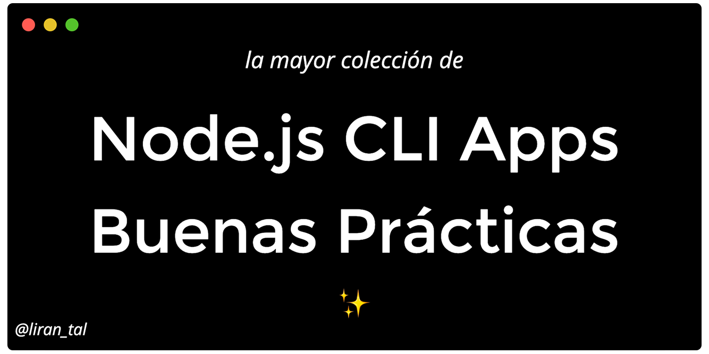

<p align="center">
  
</p>

<p align="center">
  <h1 align="center">Buenas Prácticas para las Aplicaciones CLI en Node.js</h1>
Aquí encontrarás una colección de buenas prácticas sobre cómo crear aplicaciones de interfaz de línea de comando (CLI) empáticas y fáciles de usar.
</p>

### El porqué de la guía

Una CLI difícil y compleja puede desmotivar fácilmente a los usuarios de interactuar con ella. La creación de CLIs amigables requiere atención, detalle y empatía con el usuario con el fin de generar una buena experiencia. Es muy fácil equivocarse.

En esta guía he recopilado una lista con las mejores prácticas en distintos enfoques con el objetivo de mejorar la experiencia de usuario a la hora de interactuar con una aplicación CLI.

### Características:

- ✅ 21 mejores prácticas para crear aplicaciones CLI en Node.js
- ✅ Leer en un idioma diferente: [🇨🇳](./README_zh.md), [🇪🇸](./README_es.md) o ayuda a traducirlas a otro idioma: [ [🇩🇪](./README-de.md) , ... ]
- 🙏 Las contribuciones son bienvenidas

<!-- Shields -->
<p align="center">
<a rel="license" href="http://creativecommons.org/licenses/by-sa/4.0/"></a>

<a href="https://www.github.com/lirantal/nodejs-cli-apps-best-practices" target="_blank">
  
</a>
</p>

### Algo más sobre mi

Hola, Soy [Liran Tal](https://twitter.com/liran_tal) y soy un adicto a la creación de aplicaciones en línea de comandos.

Algunos de mis trabajos más recientes con la creación de aplicaciones CLI en Node.js incluyen los siguientes proyectos Open Source:

<!-- prettier-ignore-start -->
<!-- markdownlint-disable -->
<table>
  <tr>
     <td align="center">
      <a href="https://github.com/lirantal/dockly"><br /><sub><b>Dockly</b></sub></a><br/>Interfaz de terminal inmersiva para administrar contenedores y servicios acoplables
     </td>
     <td align="center">
      <a href="https://github.com/lirantal/npq"><br /><sub><b>npq</b></sub></a><br/>Instale paquetes de forma segura con npm/yarn auditándolos como parte de su proceso de instalación
     </td>
     <td align="center">
      <a href="https://github.com/lirantal/lockfile-lint"><br /><sub><b>lockfile-lint</b></sub></a><br/>Lint para lockfile de npm o yarn para analizar y detectar problemas de seguridad
     </td>
     <td align="center">
      <a href="https://github.com/lirantal/is-website-vulnerable"><br /><sub><b>is-website-vulnerable</b></sub></a><br/>Encuentre vulnerabilidades de seguridad conocidas públicamente en las bibliotecas JavaScript frontend de un sitio web
     </td>
  </tr>
</table>
<!-- markdownlint-enable -->
<!-- prettier-ignore-end -->

### El Equipo ✨

Gracias a estas maravillosas personas ([emoji key](https://allcontributors.org/docs/en/emoji-key)):

<!-- ALL-CONTRIBUTORS-LIST:START - Do not remove or modify this section -->
<!-- prettier-ignore-start -->
<!-- markdownlint-disable -->
<table>
  <tr>
    <td align="center"><a href="https://blog.vvni.top/"><br /><sub><b>Vanilla</b></sub></a><br /><a href="#translation-vvni" title="Translation">🌍</a></td>
    <td align="center"><a href="https://terkel.com"><br /><sub><b>Terkel</b></sub></a><br /><a href="#content-terkelg" title="Content">🖋</a></td>
    <td align="center"><a href="http://jasonkarns.com"><br /><sub><b>Jason Karns</b></sub></a><br /><a href="#content-jasonkarns" title="Content">🖋</a></td>
    <td align="center"><a href="https://about.me/davesag"><br /><sub><b>Dave Sag</b></sub></a><br /><a href="#maintenance-davesag" title="Maintenance">🚧</a></td>
    <td align="center"><a href="https://josejpr.com"><br /><sub><b>José J. (Pepe)</b></sub></a><br /><a href="#translation-JoseJPR" title="Translation">🌍</a></td>
    <td align="center"><a href="https://twitter.com/MSuresh100"><br /><sub><b>Sureshraj</b></sub></a><br /><a href="#content-m-sureshraj" title="Content">🖋</a></td>
  </tr>
</table>

<!-- markdownlint-enable -->
<!-- prettier-ignore-end -->
<!-- ALL-CONTRIBUTORS-LIST:END -->

---

<h3>Contenido</h3>

- 1 Experiencia en Línea de Comando
  - 1.1 [Respeta los argumentos POSIX](#11-respect-posix-args)
  - 1.2 [Crea CLIs empáticos](#12-build-empathic-clis)
  - 1.3 [Stateful del dato](#13-stateful-data)
  - 1.4 [Proporcione una experiencia con color](#14-provide-a-colorful-experience)
  - 1.5 [Interacciones enriquecidas](#15-rich-interactions)
  - 1.6 [Hipervínculos en todas partes](#16-hyperlinks-everywhere)
  - 1.7 [Cero configuración](#17-zero-configuration)
  - 1.8 [Respetar las señales POSIX](#18-respect-posix-signals)
- 2 Distribución
  - 2.1 [Prefiera dependencias pequeñas](#21-prefer-a-small-dependency-footprint)
  - 2.2 [Utilice shrinkwrap, Luke](#22-use-the-shrinkwrap-luke)
  - 2.3 [Limpieza en los archivos de configuración](#23-cleanup-configuration-files)
- 3 Interoperabilidad
  - 3.1 [Aceptar entradas como STDIN](#31-accept-input-as-stdin)
  - 3.2 [Habilitar una salida estructurada](#32-enable-structured-output)
  - 3.3 [Etiqueta multiplataforma](#33-cross-platform-etiquette)
  - 3.4 [Permita anulaciones del entorno](#34-allow-environment-overrides)
- 4 Accesibilidad
  - 4.1 [Contenedor para la CLI](#41-containerize-the-cli)
  - 4.2 [Graceful degradation](#42-graceful-degradation)
  - 4.3 [Compatibilidad con versiones de Node.js](#43-nodejs-versions-compatibility)
  - 4.4 [Shebang para detectar de forma automática el runtime de Node.js](#44-shebang-autodetect-the-nodejs-runtime)
- 5 Testing
  - 5.1 [No confíes en los locales](#51-put-no-trust-in-locales)
- 6 Errores
  - 6.1 [Errores informativos](#61-informational-errors)
  - 6.2 [Errores procesados](#62-actionable-errors)
  - 6.3 [Proporcionar el modo de depuración](#63-provide-debug-mode)
  - 6.4 [Uso adecuado de los códigos de salida.](#64-proper-use-of-exit-codes)
  - 6.5 [Informes de errores sin esfuerzo](#65-effortless-bug-reports)
- 7 Desarrollo
  - 7.1 [Utilice un objeto bin](#71-use-a-bin-object)
  - 7.2 [Utilice rutas relativas](#72-use-relative-paths)
  - 7.3 [Utilice el campo `files`](#73-use-the-files-field)

---

# 1 Experiencia en Línea de Comando

Esta sección trata de las mejores prácticas relacionadas con la creación de aplicaciones de línea de comandos Node.js atractivas y de gran valor para el usuario.

En esta sección:

- 1.1 [Respeta los argumentos POSIX](#11-respect-posix-args)
- 1.2 [Crea CLIs empáticos](#12-build-empathic-clis)
- 1.3 [Stateful del dato](#13-stateful-data)
- 1.4 [Proporcione una experiencia con color](#14-provide-a-colorful-experience)
- 1.5 [Interacciones enriquecidas](#15-rich-interactions)
- 1.6 [Hipervínculos en todas partes](#16-hyperlinks-everywhere)
- 1.7 [Cero configuración](#17-zero-configuration)
- 1.8 [Respetar las señales POSIX](#18-respect-posix-signals)

<br>

### 1.1 Respeta los argumentos POSIX

✅ **Haga:** Utilice [POSIX-compliant](https://pubs.opengroup.org/onlinepubs/9699919799/basedefs/V1_chap12.html) como sintaxis para argumentos de línea de comando, está ampliamente aceptado como estándar para las herramientas de línea de comando.

❌ **De lo contrario:** Los usuarios pueden sentirse frustrados cuando la sintaxis de argumentos de una CLI, opciones o parámetros de comando se desvían de los estándares base de Unix a los que están acostumbrados.

ℹ️ **Detalles**

Los sistemas operativos tipo Unix popularizaron el uso de la línea de comandos y herramientas como `awk` y/o `sed`. Estas han estandarizado el comportamiento de las opciones de línea de comando (también conocidas como banderas), argumentos y otros operadores.

Algunos ejemplos de comportamiento:

- Argumentos de opción u opciones se pueden anotar en la ayuda y/o en ejemplos con corchetes (`[]`) para indicar que son opcionales, o con corchetes angulares (`<>`) para indicar que son obligatorios.
- Opciones especificadas utilizando la forma abreviada singular `-` puede contener un carácter alfanumérico.
- Especificación de múltiples opciones sin valores pueden ser agrupadas como `myCli -abc` siendo equivalente a `myCli -a -b -c`.

Los usuarios avanzados con la línea de comando esperarán que su aplicación de línea de comando tenga convenciones similares a otras aplicaciones de Unix.

📦 **Paquetes recomendados**

Referencia a los paquetes Open Source para Node.js:

- [commander](https://github.com/tj/commander.js#readme)
- [yargs](https://github.com/yargs/yargs)

### 1.2 Crea CLIs empáticos

✅ **Haga:** Establezca flujos de trabajo que ayuden al usuario a interactuar con la CLI de forma correcta, de lo contrario es posible que las interacciones den lugar a errores y frustración.

❌ **De lo contrario:** Si no se proporciona asistencia para guiar al usuario, se generará frustración debido a la falta de capacidad para operar con la CLI.

ℹ️ **Detalles**

Una interfaz de línea de comandos no es diferente de una interfaz de usuario web en el sentido de hacer todo lo posible para asegurarse de que se esté utilizando de forma correcta y satisfactoria.

Optimice las interacciones satisfactorias mediante la creación de CLIs empáticas que guíen al usuario. Como ejemplo, analicemos el caso de utilizar el programa `curl` el cual espera una URL como entrada de datos y que el usuario no pueda proporcionarla. Tal fallo guiará al usuario con mensajes de error descriptivos (con suerte) o con la revisión de una ayuda `curl --help`. Sin embargo, una CLI empática habría presentado un mensaje interactivo para capturar la información del usuario, lo que desembocaría en una interacción satisfactoria.

### 1.3 Stateful del dato

✅ **Haga:** Proporcione una experiencia con memoria de estado entre múltiples invocaciones de la aplicación CLI y recuerde valores y datos para proporcionar una interacción perfecta.

❌ **De lo contrario:** Requerir que el usuario proporcione de forma repetitiva la misma información en múltiples invocaciones de la CLI molestará a su usuario.

ℹ️ **Detalles**

Es posible que necesite proporcionar persistencia de datos para la aplicación CLI, como podrá ser la de recordar un nombre de usuario, correo electrónico, token de una API u otras preferencias entre múltiples invocaciones de la CLI. Utilice un asistente de configuración que permita a la aplicación ofrecer persistencia de estas configuraciones de usuario. En este caso asegúrese de seguir la [XDG Base Directory Specification](https://specifications.freedesktop.org/basedir-spec/basedir-spec-latest.html) cuando lea/escriba archivos (o elige un asistente de configuración para esta especificación). Esto mantendrá al usuario con el control de dónde se escriben y administran los archivos.

Proyectos de referencia:

- [configstore](https://www.npmjs.com/package/configstore)
- [conf](https://www.npmjs.com/package/conf)

### 1.4 Proporcione una experiencia con color

✅ **Haga:** Utilice colores en su aplicación CLI para resaltar partes de la salida de su aplicación y proporcione una lectura fácil con la detección de color para permitir la exclusión de partes de la salida que puedan ser confusa. Asegúrese de que la opción de entrada y salida manual sea posible mediante la opción CLI, la variable de entorno y / o el archivo de configuración.

❌ **De lo contrario:** La información puede perderse fácilmente en la salida especialmente cuando la salida tiene mucho texto.

ℹ️ **Detalles**

La mayoría de los terminales utilizados hoy en día para interactuar con aplicaciones de línea de comandos admiten texto en color habilitados por caracteres codificados ANSI especialmente diseñados.

Una pantalla con color en la salida puede contribuir aún más a una experiencia más rica y a una mayor interacción. Dicho esto, los terminales no compatibles pueden experimentar una salida en forma de información confusa. Además, se puede usar una CLI en trabajos de compilación con integración continua que puede no admitir resultados coloreados. Incluso fuera de los servidores de compilación, se puede usar una CLI a través de la consola de un IDE que puede no manejar ciertos caracteres. La exclusión manual debe estar disponible.

Proyectos de referencia:

- [chalk](https://www.npmjs.com/package/chalk)
- [colors](https://www.npmjs.com/package/colors)
- [kleur](https://www.npmjs.com/package/kleur)

📦 **Paquetes recomendados**

Paquetes de referencia Open Source para Node.js:

- [chalk](https://www.npmjs.com/package/chalk)
- [colors](https://www.npmjs.com/package/colors)
- [kleur](https://www.npmjs.com/package/kleur)

### 1.5 Interacciones enriquecidas

✅ **Haga:** Aproveche el uso de interacciones de línea de comandos enriquecidas más allá de los principios básicos de la entrada de texto para proporcionar una experiencia más fluida a los usuarios de CLI.

❌ **De lo contrario:** Un mensaje de texto como entrada puede resultar engorroso para los usuarios cuando los datos son en forma de opciones cerradas (es decir, menús desplegables).

ℹ️ **Detalles**

Se puede mejorar la interactividad en forma de entradas rápidas, que son más sofisticadas que el texto libre, como listas de selección desplegables, botones de radio, clasificación, autocompletar o entradas de contraseña ocultas.

Otro tipo de interactividad enriquecida es en forma de loaders animados y barras de progreso que proporcionan una mejor experiencia para los usuarios cuando se realiza un trabajo asincrónico.

Muchas CLI proporcionan argumentos de línea de comandos predeterminados sin requerir ninguna experiencia interactiva adicional. No obligue a sus usuarios a proporcionar parámetros que la aplicación pueda resolver por sí misma.

📦 **Paquetes recomendados**

Paquetes de referencia Open Source para Node.js:

- [enquirer](https://www.npmjs.com/package/enquirer)
- [ora](https://www.npmjs.com/package/ora)
- [ink](https://www.npmjs.com/package/ink)
- [prompts](https://www.npmjs.com/package/prompts)

### 1.6 Hipervínculos en todas partes

✅ **Haga:** Utilice hipervínculos formateados correctamente en la salida de texto para ambas URLs (e.g: `https://www.github.com`), así como el código fuente (e.g: `src/Util.js:2:75`) - ambos terminales modernos pueden transformarse en un enlace en el que se puede hacer clic.

❌ **De lo contrario:** Evite los enlaces rotos y no interactivos como `git.io/abc` que requieren que su usuario copie y pegue manualmente.

ℹ️ **Detalles**

Si está compartiendo enlaces a URL o apuntando a un archivo y a un número de línea y columna específicos en el archivo, puede proporcionar enlaces formateados a estos dos ejemplos que, una vez que se haga clic, abrirán el navegador o un IDE con la zona definida.

### 1.7 Cero configuración

✅ **Haga:** Optimice una experiencia plug-and-play al detectar automáticamente la configuración requerida y los valores de los argumentos de la línea de comandos

❌ **De lo contrario:** No fuerce la interactividad del usuario si un argumento de línea de comandos se puede detectar automáticamente de una manera fiable, y de esta forma la acción invocada no requiera explícitamente la interacción del usuario (como confirmar una eliminación).

ℹ️ **Detalles**

Trate de proporcionar una experiencia "lista para usar" al ejecutar la aplicación CLI.
Por ejemplo, [POSIX define un estándar para la configuración de variables de entorno] (https://pubs.opengroup.org/onlinepubs/009695399/basedefs/xbd_chap08.html) utilizado para diferentes propósitos, como: `TMPDIR`,` NO_COLOR`, `DEBUG`,` HTTP_PROXY` y otros. Detecte estos automáticamente y solicite confirmación cuando sea necesario.

Proyectos de referencia que se construyen bajo la idea de la Cero Configuración:

- [Jest JavaScript Testing Framework](https://jestjs.io)
- [Parcel](https://parceljs.org), un paquete de aplicaciones web

### 1.8 Respetar las señales POSIX

✅ **Haga:** Asegúrese de que su programa respete las [señales POSIX](http://man7.org/linux/man-pages/man7/signal.7.html) para permitir una interacción adecuada con los usuarios u otros programas.

❌ **De lo contrario:** Su programa no funcionará bien con otros programas y provocará un comportamiento inesperado.

ℹ️ **Detalles**

Especialmente para las aplicaciones CLI, es común interactuar con la entrada del usuario y una gestión inadecuada de eventos del teclado, eso puede provocar que su aplicación no responda a las interrupciones SIGINT, comúnmente utilizadas por los usuarios cuando presionan las teclas `CTRL+C`.

El problema de no respetar las señales de proceso empeora cuando el programa está siendo orquestado por una interacción no humana. Por ejemplo, una CLI que se ejecuta en un contenedor pero no responde a las señales de interrupción de software que se le envían.

# 2 Distribución

Esta sección trata las mejores prácticas relacionadas con la distribución y el empaquetado de una aplicación de línea de comandos Node.js.

En esta sección:

- 2.1 [Prefer a small dependency footprint](#21-prefer-a-small-dependency-footprint)
- 2.2 [Utilice shrinkwrap, Luke](#22-use-the-shrinkwrap-luke)
- 2.3 [Limpieza en los archivos de configuración](#23-cleanup-configuration-files)

### 2.1 Prefiera dependencias pequeñas

✅ **Haga:** Minimice el uso de dependencias de producción, use dependencias alternativas que sean más pequeñas y verifique sus dependencias, así como dependencias transitivas para garantizar un pequeño paquete de la CLI de Node.js. Juegue con esto teniendo cuidado de no optimizar demasiado el uso de dependencias reinventando la rueda.

❌ **De lo contrario:** El tamaño y el uso de las dependencias en la aplicación afectarán el tiempo de instalación de su CLI de Node.js, lo que podría proporcionar una mala experiencia de usuario.

ℹ️ **Detalles**

Un rápido `npm install` con el que invocar las aplicaciones de lineas de comandos en Node.js CLIs con `npx` puede proporcionar una mejor experiencia de usuario. Esto es posible cuando la dependencia general, y la dependencia transitiva mantiene a un tamaño razonable.

La instalación global `npm` de un paquete de `npm` es de instalación lenta y ofrecerá una mala experiencia, pero el uso de `npx` para invocar paquetes ejecutables hará que el rendimiento mejore, debido a que `npx` siempre busca e instala paquetes desde su registro que son más significativos.

Proyectos de referencia:

- [Bundlephobia](https://bundlephobia.com/) es una herramienta para ayudarlo a encontrar el costo de un paquete npm.

### 2.2 Utilice shrinkwrap, Luke

✅ **Haga:** Utilice `npm-shrinkwrap.json` de npm como un archivo de bloqueo para garantizar que las versiones de dependencia fijadas (directas y transitivas) se propaguen a sus usuarios finales cuando instalen su paquete npm.

❌ **De lo contrario:** No corregir las versiones de las dependencias de su aplicación significará que el administrador de paquetes (por ejemplo, `npm`) las resolverá durante la instalación, y las dependencias transitivas instaladas a través de rangos de versiones pueden introducir cambios importantes que no puede controlar, lo que puede resultar en su aplicación Node.js no pueda compilarse o ejecutarse.

ℹ️ **Detalles**

Utilice el ~~force~~ shrinkwrap, Luke!

Normalmente, un paquete npm solo define sus dependencias directas, y su rango de versiones, cuando se instala, y el administrador de paquetes npm resolverá todas las versiones de dependencias transitivas después de la instalación. Con el tiempo, las versiones de las dependencias variarán, ya que las nuevas dependencias directas y transitivas lanzarán nuevas versiones.

Aunque el [Versionado Semántico](https://semver.org/) es ampliamente aceptado, sabemos que npm [introduce muchas dependencias](https://snyk.io/blog/how-much-do-we-really-know-about-how-packages-behave-on-the-npm-registry/) en el paquete que se está instalando, lo que aumenta el riesgo de que un paquete introduzca cambios que puedan dañar su aplicación.

La otra cara del uso de `npm-shrinkwrap.json` son las implicaciones de seguridad que imponemos. Las dependencias que se instalan están ancladas a versiones específicas, por lo que incluso si se lanzan versiones más nuevas de estas dependencias, no se instalarán. Esto le transfiere la responsabilidad a usted, la persona que mantiene el proyecto, de tenerlo actualizado con cualquier corrección de seguridad en sus dependencias, y lanzar su aplicación CLI regularmente con actualizaciones de seguridad. Considere usar la [Actualización de dependencia de Snyk](https://snyk.io/) para corregir automáticamente los problemas de seguridad en su árbol de dependencias. *Revelación: soy un desarrolladores defensor en Snyk*.

> 👍 Consejo
> Utilice el comando `npm shrinkwrap` para generar el archivo de bloqueo shrinkwrap, que tiene el mismo formato que el archivo `package-lock.json`.

Referencias:

- [¿Realmente sabes cómo funciona un archivo de bloqueo para paquetes de Yarn y npm?](https://snyk.io/blog/making-sense-of-package-lock-files-in-the-npm-ecosystem/)
- [Documentos de Yarn: ¿Deben comprometerse los archivos de bloqueo en el repositorio?](https://next.yarnpkg.com/advanced/qa#should-lockfiles-be-committed-to-the-repository)

### 2.3 Limpieza en los archivos de configuración

✅ **Haga:** Limpie los archivos de configuración cuando se desinstale la aplicación CLI. Opcionalmente, las aplicaciones CLI pueden solicitar a sus usuarios que guarden los archivos de configuración para omitir la configuración en la fase de reinicialización para una mejor experiencia de usuario.

❌ **De lo contrario:** El sistema de almacenamiento del usuario puede contener residuos en forma de archivos de configuración huérfanos y datos identificables que la herramienta CLI generó cuando se instaló.

ℹ️ **Detalles**

Como se menciona en la [Stateful del dato] (#13-stateful-data), si su aplicación CLI usa almacenamiento persistente para guardar archivos de configuración, la aplicación CLI también debería ser responsable de eliminar dichos archivos cuando se desinstale .

Puede usar NPMs `pre` o` post` desinstalar [script](https://docs.npmjs.com/misc/scripts) para conseguirlo. Puede encontrar un ejemplo funcional en este [repositorio](https://github.com/m-sureshraj/jenni/blob/master/src/scripts/pre-uninstall.js).

# 3 Interoperabilidad

Esta sección sobre las mejores prácticas relacionadas con hacer que su CLI de Node.js se integre perfectamente con otras herramientas de línea de comandos y siga una conversación natural para que las CLI operen entre si.

En esta sección encontrarás respuestas a preguntas como:

- *¿Puedo exportar la salida de la CLI para un parsing fácil?*
- *¿Puedo canalizar la salida de esta CLI a la entrada de otra herramienta de línea de comando?*
- *¿Puedo canalizar el resultado de otra herramienta a mi CLI?*

En esta sección:

- 3.1 [Aceptar entradas como STDIN](#31-accept-input-as-stdin)
- 3.2 [Habilitar una salida estructurada](#32-enable-structured-output)
- 3.3 [Etiqueta multiplataforma](#33-cross-platform-etiquette)
- 3.4 [Permita anulaciones del entorno](#34-allow-environment-overrides)

### 3.1 Aceptar entradas como STDIN

✅ **Haga:** Para las aplicaciones de línea de comandos que se espera que funcionen con datos, facilite al usuario el canalizar los datos a una entrada estándar (STDIN).

❌ **De lo contrario:** Otras aplicaciones de línea de comandos no podrán proporcionar su resultado directamente como entrada para su CLI, lo que evita las acciones comunes de UNIX como:

```sh
$ curl -s "https://api.example.com/data.json" | your_node_cli
```

ℹ️ **Detalles**

Si la aplicación de línea de comando funciona con datos, como realizar algún tipo de tarea en un archivo JSON que generalmente se especifica con el argumento `--file <file.json>`.

Un ejemplo basado en los documentos oficiales de la [API de Node.js para el módulo for readline](https://nodejs.org/api/readline.html) de cómo tomar la entrada de una pipe sería el siguiente:

```js
const readline = require("readline");

const rl = readline.createInterface({
  input: process.stdin,
  output: process.stdout
});

rl.question("What do you think of Node.js? ", answer => {
  // TODO: Log the answer in a database
  console.log(`Thank you for your valuable feedback: ${answer}`);

  rl.close();
});
```

Luego defina la entrada a la aplicación Node.js anterior:

```sh
echo "Node.js is amazing" | node cli.js
```

### 3.2 Habilitar una salida estructurada

✅ **Haga:** Habilite una bandera que permitir la salida estructurada del resultado de la aplicación, si dicho resultado está disponible permitirá el análisis y la manipulación fácil de los datos.

❌ **De lo contrario:** Los usuarios de la CLI pueden necesitar aplicar técnicas complicadas de análisis y comparación de expresiones regulares para extraer los datos de salida proporcionados por su CLI.

ℹ️ **Detalles**

A menudo es útil para los usuarios de una aplicación de línea de comandos analizar los datos y realizar otras tareas con ellos, como usarlos para nutrir de información a paneles web o notificaciones por correo electrónico.

Poder extraer fácilmente los datos de interés de una salida de línea de comandos proporciona una experiencia más amigable para los usuarios de su CLI.

### 3.3 Etiqueta multiplataforma

✅ **Haga:** Si se espera que sea una CLI multiplataforma, se debe prestar la debida atención a la semántica de los shells de comandos y sus componentes como los sistemas de archivos.

❌ **De lo contrario:** La CLI se interrumpirá en otros sistemas operativos debido a factores como caracteres especiales, separadores de ruta entre otros, aunque no haya diferencias funcionales en el código.

ℹ️ **Detalles**

Aunque, desde la perspectiva del programa la funcionalidad no se está reduciendo y *debería* ejecutarse bien en diferentes sistemas operativos, algunos matices pueden hacer que el programa no funcione. Revisemos algunos casos en los que se debe respetar la ética multiplataforma.

#### El aparecer un comando de forma incorrecta

Es posible que deba generar un proceso que ejecute un programa Node.js. Por ejemplo, si tiene el siguiente script:

`program.js`

```js
#!/usr/bin/env node

// the rest of your app code
```

Esto funciona:

```
const cliExecPath = 'program.js'
const process = childProcess.spawn(cliExecPath, [])
```

Esto sería mejor:

```
const cliExecPath = 'program.js'
const process = childProcess.spawn('node', [cliExecPath])
```

¿Por qué es mejor? El código de `program.js` comienza con la notación [Shebang](https://en.wikipedia.org/wiki/Shebang_(Unix)) similar a Unix, sin embargo, Windows no sabe cómo interpretarlo debido a que Shebang no es un estándar multiplataforma.

Esto también ocurre en los scripts `package.json`. Considere lo siguiente como una mala práctica a la hora de definir un script de ejecución npm:

```
"scripts": {
  "postinstall": "myInstall.js"
}
```

Esto hace que Shebang en `myInstalls.js` no ayude a Windows a comprender cómo ejecutarlo con el intérprete `node`.

En cambio, utilice la mejor práctica de:

```
"scripts": {
  "postinstall": "node myInstall.js"
}
```

#### Las intérpretes de shell varían

No todos los caracteres se tratan de la misma manera en diferentes intérpretes de shell.

Por ejemplo, el símbolo del sistema de Windows no trata una comilla simple igual que una comilla doble, como se esperaría en un shell bash, por lo que no reconoce que toda la cadena dentro de las comillas simple pertenezca a la misma cadena, lo que conducirá a errores.

Esto fallará en un entorno Node.js en Windows en el que use el símbolo del sistema de Windows:

package.json

```
"scripts": {
  "format": "prettier-standard '**/*.js'",
  ...
}
```

Para solucionarlo y conseguir que el script `npm run` sea multiplataforma entre Windows, macOS y Linux:

package.json

```
"scripts": {
  "format": "prettier-standard \"**/*.js\"",
  ...
}
```

En este ejemplo, tuvimos que usar comillas dobles y escapar la notación JSON.

#### Evita concatenar paths

Los paths se construyen de manera diferente en diferentes plataformas. Cuando se construyen manualmente mediante la concatenación de cadenas, es probable que no sean utilizables entre diferentes plataformas.

Consideremos el siguiente ejemplo una mala práctica:

```js
const myPath = `${__dirname}/../bin/myBin.js`;
```

Se supone que la barra diagonal es el separador de ruta donde en Windows, por ejemplo, se utiliza una barra diagonal inversa.

En lugar de crear manualmente rutas consulte el módulo `path` de Node.js para hacer esto:

```js
const myPath = path.join(__dirname, "..", "bin", "myBin.js");
```

#### Evite enlazar comandos con puntos y comas

Los shells de Linux son compatibles con puntos y comas (`;`) para encadenar comandos y que se ejecuten secuencialmente, como: `cd /tmp; ls`. Sin embargo en Windows fallará.

Evita hacer lo siguiente:

```js
const process = childProcess.exec(`${cliExecPath}; ${cliExecPath2}`);
```

En su lugar, use las anotaciones de doble ampersand o double pipe:

```js
const process = childProcess.exec(`${cliExecPath} || ${cliExecPath2}`);
```

### 3.4 Permita anulaciones del entorno

✅ **Haga:** Permita que la configuración se lea desde las variables de entorno y, cuando entre en conflicto con los argumentos de la línea de comandos, permita que las variables de entorno se anulen.

❌ **De lo contrario:** No se podrá invocar la CLI con una configuración personalizada.

ℹ️ **Detalles**

Detecte y admita la configuración mediante variables de entorno, ya que será una forma común en muchas herramientas con el fin de modificar el comportamiento de la aplicación CLI ejecutada.

El orden de precedencia de configuración para las aplicaciones de línea de comandos debe seguir estas reglas:
- Argumentos de la línea de comando especificados cuando se invoca la aplicación.
- Las variables de entorno del shell generada y cualquier otra variable de entorno disponible para la aplicación.
- La configuración del proyecto, por ejemplo: un archivo de directorio local `.git / config`.
- La configuración del usuario, por ejemplo: el archivo de configuración del directorio de inicio del usuario: `~ / .gitconfig` o su equivalente XDG:` ~ / .config / git / config`.
- La configuración del sistema, por ejemplo: `/ etc / gitconfig`.

Proyectos de referencia:

- [cosmiconfig](https://github.com/davidtheclark/cosmiconfig)

# 4 Accesibilidad

Esta sección trata las mejores prácticas relacionadas con hacer que una aplicación CLI de Node.js esté disponible para los usuarios que desean consumirla, pero que carecen del entorno para el que el responsable diseñó la aplicación.

En esta sección:

- 4.1 [Contenedor para la CLI](#41-containerize-the-cli)
- 4.2 [Graceful degradation](#42-graceful-degradation)
- 4.3 [Compatibilidad con versiones de Node.js](#43-nodejs-versions-compatibility)
- 4.4 [Shebang para detectar de forma automática el runtime de Node.js](#44-shebang-autodetect-the-nodejs-runtime)

### 4.1 Contenedor para la CLI

✅ **Haga:** Cree una imagen de Docker para la CLI y publíquela en un registro público como Docker Hub para que los usuarios sin un entorno Node.js puedan usarla.

❌ **De lo contrario:** Los usuarios sin un entorno Node.js tampoco tendrán `npm` o `npx` disponibles, por lo que no podrán ejecutar su aplicación CLI.

ℹ️ **Detalles**

La instalación de las aplicaciones de CLI de Node.js desde el registro npm generalmente se realizan con herramientas nativas de Node.js, como `npm` o `npx`. Estos son comunes entre los desarrolladores de JavaScript y Node.js, y esperan que se mencionen en las instrucciones de instalación.

Sin embargo, si está pensando a una aplicación CLI para el público en general, independientemente de su familiaridad con JavaScript o estas herramientas, entonces la distribución de su aplicación CLI solo desde npm en forma de instalación será restrictivo. Si su aplicación CLI está diseñada para ser utilizada en un entorno de compilación o CI, entonces también se les puede requerir que instalen las dependencias de herramientas relacionadas con Node.js.

Hay muchas formas de empaquetar y distribuir un ejecutable, y prepararlo como un contenedor Docker que viene incluido con su aplicación CLI es una alternativa fácil de utilizar y sin dependencia (a parte de requerir un entorno Docker).

### 4.2 Graceful degradation

✅ **Haga:** Provee a los usuarios la posibilidad de optar entre una visualización con color y animaciones, como omitirla y proporcionar resultados en forma de JSON en entornos no compatibles.

❌ **De lo contrario:** Proveer de una salida con color, el uso de interactivos y otras interfaces enriquecidas en pantallas para los usuarios que no tienen un terminal compatible puede empeorar significativamente la experiencia del usuario final y que opten por no usar su aplicación CLI.

ℹ️ **Detalles**

Es común proporcionar una pantalla de terminal enriquecida en color, gráficos ascii o incluso animación en la terminal como un potente mecanismo de aviso. Estos pueden contribuir a una muy buena experiencia de usuario para aquellos que tienen un terminal compatible, sin embargo, puede mostrar texto ilegible o ser completamente inoperable para aquellos sin él.

Para permitir que los usuarios con un terminal no compatible utilicen correctamente la aplicación Node.js CLI, puede optar por:

- Detecta automáticamente la capacidad del terminal y evaluar durante el tiempo de ejecución si diminuye la interactividad de la CLI.
- Proporcione una opción para que los usuarios activen explícitamente esta opción, por ejemplo, proporcionando un argumento de línea de comandos `--json` para forzar la generación de datos en formato raw.

```
👍  Consejo

  Aportar la opción enriquecida en la salida como JSON no solo es útil para usuarios finales, también lo es para entornos de integración continua, además de permitir a los usuarios la capacidad de conectar la salida de su programa con la entrada de otro programa o exportar datos si fuera necesario.
```

### 4.3 Compatibilidad con las versiones de Node.js

✅ **Haga:** Soporte y mantenimiento para las [versiones de Node.js](https://nodejs.org/en/about/releases).

❌ **De lo contrario:** Será difícil que la base de código se mantenga compatible con versiones de Node.js anteriores, y perderá los beneficios del lenguaje y las características del runtime.

ℹ️ **Detalles**

A veces puede ser necesario apostar por versiones anteriores de Node.js específicas a las que les faltan nuevas características de ECAMScript. Por ejemplo, si está creando una CLI de Node.js que está orientada principalmente a DevOps o IT, es posible que no tengan un entorno Node.js ideal con una versión actualizada. Como referencia, Debian Stretch (oldstable) se genera con [Node.js 8.11.1](https://packages.debian.org/search?suite=default&section=all&arch=any&searchon=names&keywords=nodejs).

Si necesita trabajar con versiones antiguas de Node.js como Node.js 8, 6 o 4, quizás prefiera usar un transpilador como Babel para asegurarse de que el código generado cumpla con la versión del motor V8 JavaScript y el runtime de Node.js incluido con esas versiones.

Otra solución es proporcionar una versión en un contenedor para evitar versiones antiguas. Vea la sección [(4.1) Contenedor para la CLI](#containerize-the-cli).

No trabaje el código de su programa pensando en una version específica del lenguaje ECMAScript anterior que coincida con versiones no mantenidas o EOL Node.js ya que esto solo conducirá a futuros problemas con el mantenimiento del código.

Si se invoca la CLI en un entorno no compatible, intente detectarlo y muestre con un mensaje de error descriptivo con información. Vea [este ejemplo](https://github.com/lirantal/dockly/blob/42d8c09631bc5348f108a50c3ce9601851fb760b/index.js#L25) por dockly.

### 4.4 Shebang para detectar de forma automática el runtime de Node.js

✅ **Haga:** Utilice una referencia [Shebang](https://en.wikipedia.org/wiki/Shebang_(Unix)) para una instalación agnóstica que localice el tiempo de ejecución automáticamente el entorno de Node.js, como `#!/usr/bin/env node`.

❌ **De lo contrario:** Utilizar una ubicación de Node.js "hard-coded" como `#!/usr/local/bin/node` solo es específico de su propio entorno y puede hacer que la CLI de Node.js no funcione en otros entornos donde la ubicación de Node.js es diferente.

ℹ️ **Detalles**

Puede ser normal comenzar a desarrollar una CLI de Node.js ejecutando el archivo de entrada `node cli.js` y agregar `#!/usr/local/bin/node` en el comienzo de `cli.js`, sin embargo, esto sigue siendo un enfoque erróneo ya que la ubicación del ejecutable de `node` no está garantizado para los entornos de otros usuarios.

Cabe señalar que especificar `#!/usr/bin/env node` como la mejor práctica, sigue suponiendo que el runtime de Node.js sea como `node` y no `nodejs` o al contrario.

# 5 Testing

En esta sección:

- 5.1 [No confíes en los locales](#51-put-no-trust-in-locales)

### 5.1 No confíes en los locales

✅ **Haga:** No asuma que el texto de salida es equivalente a una cadena que usted piense porque las pruebas pueden ejecutarse en sistemas con configuraciones regionales diferentes a las suyas o con un inglés predeterminado.

❌ **De lo contrario:** Los desarrolladores experimentarán errores mientras realizan pruebas en sistemas con configuraciones regionales diferentes a las predeterminadas en inglés.

ℹ️ **Detalles**

A medida que realize testing en una CLI ejecutándola y revisando la salida, puede buscar características específicas para asegurarse de que existan en la salida, como proporcionar ejemplos correctamente cuando la CLI se ejecuta sin argumentos. ej:

```js
const output = execSync(cli);
expect(output).to.contain("Examples:"));
```

Cuando las pruebas se ejecuten entornos con configuraciones regionales que no estén basadas en inglés, y si su análisis de argumentos CLI admite la detección automática de la configuraciones regionales, las pruebas como esta fallarán, debido a la posible conversión de `Examples` al idioma equivalente a la configuración regional que se establece predeterminada en el sistema.

# 6 Errores

Esta sección trata las mejores prácticas relacionadas con la creación de una aplicación Node.js CLI y que esté disponible para los usuarios que desean consumirla pero que carecen de un entorno ideal para el cual el responsable la diseñó.

En esta sección:

- 6.1 [Errores informativos](#61-informational-errors)
- 6.2 [Errores procesados](#62-actionable-errors)
- 6.3 [Proporcionar el modo de depuración](#63-provide-debug-mode)
- 6.4 [Uso adecuado de los códigos de salida.](#64-proper-use-of-exit-codes)
- 6.5 [Informes de errores sin esfuerzo](#65-effortless-bug-reports)

### 6.1 Errores informativos

✅ **Haga:** Al reportar errores, proporcione códigos de error rastreables que se puedan buscar en la documentación del proyecto y así simplificar la solución de problemas del mensaje de error.

Si es posible, muestre de forma extendida los mensajes de error con información para que puedan analizarse fácilmente y con un contexto claro.

❌ **De lo contrario:** Los mensajes de error genéricos tienden a ser ambiguos y dificultan que los usuarios busquen soluciones. Recorrer y analizar no es tan sencillo, y hacer referencia a ellos en la documentación tampoco es lo más claro.

ℹ️ **Detalles**

Asegúrese de que, cuando se devuelvan mensajes de error, incluyan un número de referencia o códigos de error específicos que luego se puedan consultar. Al igual que los códigos de estado HTTP, las aplicaciones CLI requieren errores con nombre o códigos.

Ejemplo:

```sh
$ my-cli-tool --doSomething

Error (E4002): please provide an API token via environment variables
```

### 6.2 Errores procesados

✅ **Haga:** Un mensaje de error fallido debería indicarle al usuario qué se requiere como solución, en lugar de tan solo quejarse de que hay un error.

❌ **De lo contrario:** Es posible que los usuarios que se enfrenten a mensajes de error, sin indicios de la acción a realizar para resolver el error, no puedan usar con éxito su aplicación CLI.

ℹ️ **Detalles**

Ejemplo:

```sh
$ my-cli-tool --doSomething

Error (E4002): please provide an API token via environment variables
```

### 6.3 Proporcionar el modo de depuración

✅ **Haga:** Permita que los usuarios avanzados habiliten información más detallada si necesitan diagnosticar problemas.

❌ **De lo contrario:** No omita las opciones de depuración. Será más difícil recopilar feedback de los usuarios y determinar la causa de los errores.

ℹ️ **Detalles**

Utilice variables de entorno, así como argumentos de línea de comandos para establecer la depuración y activar niveles de verbosidad. Donde tenga sentido en su código, coloque mensajes de depuración que ayuden al usuario y a los colaboradores a comprender el flujo del programa, las entradas y salidas y otras piezas de información que faciliten la resolución de problemas.

📦 **Paquetes recomendados**

Referencia a los paquetes Open Source para Node.js:

- [debug](https://www.npmjs.com/package/debug)

### 6.4 Uso adecuado de los códigos de salida.

✅ **Haga:** Termine su programa con códigos de salida adecuados que transmitan un significado semántico del error o estado de salida.

❌ **De lo contrario:** Un código de salida incorrecto impedirá el uso de su CLI en flujos de integración continua y otros casos de uso de scripts de línea de comandos.

ℹ️ **Detalles**

Los scripts de la línea de comandos a menudo utilizan el `$?` del shell para determinar el código de estado de un programa y actuar sobre él. Esto también se utiliza en flujos de integración continua (CI) para determinar si un paso se completó con éxito o no.

Si su CLI siempre termina sin un código de estado específico, incluso en caso de errores, entonces el shell y otros programas que dependen de él no tienen forma de saberlo. Cuando ocurra un error como resultado al finalizar su programa, debe transmitirlo junto con su significado. Por ejemplo:

```js
try {
  // something
} catch (err) {
  // cleanup or otherwise
  // then exit with proper status code
  process.exit(1);
}
```

Una breve referencia para los códigos de salida:

- el código de salida 0 transmite una ejecución exitosa
- el código de salida 1 transmite una error

También puede optar por utilizar códigos de salida personalizados con la semántica de su programa, pero si lo hace, asegúrese de documentarlos correctamente.

Referencia: Una [lista de códigos existentes](http://www.tldp.org/LDP/abs/html/exitcodes.html) usados por el BASH shell

### 6.5 Informes de errores sin esfuerzo

✅ **Haga:** Convierta el envío de informes de errores en una tarea sencilla proporcionando una URL para abrir una issue y rellenando previamente los datos necesarios tanto como sea posible. [Plantilla Issue de ejemplo, como en GitHub](https://docs.github.com/en/free-pro-team@latest/github/building-a-strong-community/configuring-issue-templates-for-your-repository), permite orientar a los los usuarios sobre qué información es necesaria.

❌ **De lo contrario:** Los usuarios se pueden sentir frustrados al buscar cómo informar un error y pueden terminar enviando poca información útil o incluso sin enviar ninguna issue.

# 7 Desarrollo

Esta sección trata sobre las mejores prácticas de desarrollo y mantenimiento para construir una aplicación de línea de comando Node.js.

En esta sección:

- 7.1 [Utilice un objeto bin](#71-use-a-bin-object)
- 7.2 [Utilice rutas relativas](#72-use-relative-paths)
- 7.3 [Utilice el campo `files`](#73-use-the-files-field)

### 7.1 Utilice un objeto bin

✅ **Haga:** Utilice un objeto para definir el nombre del ejecutable y su ruta.

❌ **De lo contrario:** Terminará acoplando el nombre del paquete con el ejecutable.

ℹ️ **Detalles**

El siguiente `package.json` muestra un ejemplo de desacoplamiento del nombre del ejecutable del nombre de archivo y su ubicación en el proyecto:

```json
  "bin": {
    "myCli-is-cool": "./bin/myCli.js"
  }
```

### 7.2 Utilice rutas relativas

✅ **Haga:** Use `process.cwd()` para acceder a las rutas del usuario y use `__dirname` para acceder a las rutas del proyecto.

❌ **De lo contrario:** Terminará con rutas de archivo incorrectas y no podrá acceder a ellos.

ℹ️ **Detalles**

Puede encontrarse con la necesidad de acceder a archivos dentro del alcance del proyecto, o acceder a los archivos que se proporcionan
de la entrada del usuario, como log, archivos JSON u otros. Confundir el uso de `process.cwd()` o `__dirname` puede llevar a errores, además de no utilizar ninguno de ellos.

Cómo acceder correctamente a los archivos:
- `process.cwd()`: utilícelo cuando la ruta del archivo al que necesita acceder dependa de la ubicación relativa de la CLI de Node.js. Un buen ejemplo es cuando la CLI admite rutas de archivo para crear registros, como: `myCli --outfile ../../out.json`. Si `myCli` está instalado en `/usr/local/node_modules/myCli/bin/myCli.js` entonces `process.cwd()` no se hará referencia a esa ubicación, sino al directorio de trabajo actual, que corresponde al directorio en el que se encuentre el usuario al ejecutar la CLI.
- `__dirname`: utilícelo cuando necesite acceder a un archivo desde el código fuente de la CLI y refiérase a un archivo desde la ubicación relevante del archivo en el que se encuentra el código. Por ejemplo, cuando la CLI necesita acceder a datos de un archivo JSON archivo alojado en otro directorio: `fs.readFile(path.join(__dirname, '..', 'myDataFile.json'))`.

### 7.3 Utilice el campo `files`

✅ **Haga:** Utilice el campo `files` para incluir solo los archivos necesarios en los paquetes que publique.

❌ **De lo contrario:** Terminará con un paquete que contiene archivos que pueden no ser necesarios para ejecutar su aplicación CLI. p.ej. (archivos de prueba, configuraciones de desarrollo, etc.)

ℹ️ **Detalles**

```json
"files": [
  "src",
  "!src/**/*.spec.js"
],
```

---

# Autor

**Node.js CLI Apps Best Practices** © [Liran Tal](https://github.com/lirantal), Lanzado bajo la licencia [CC BY-SA 4.0](./LICENSE).

Este proyecto sigue las especificaciones de todos los [contribuyentes](https://github.com/all-contributors/all-contributors). ¡Cualquier contribución será bienvenidas!

<!-- Project Logo -->
<!-- ALL-CONTRIBUTORS-BADGE:START - Do not remove or modify this section -->
[](#contributors-)
<!-- ALL-CONTRIBUTORS-BADGE:END -->

# Licencia

[](http://creativecommons.org/licenses/by-sa/4.0/)

Este trabajo está bajo una licencia Creative Commons Attribution-ShareAlike 4.0 Licencia Internacional.
